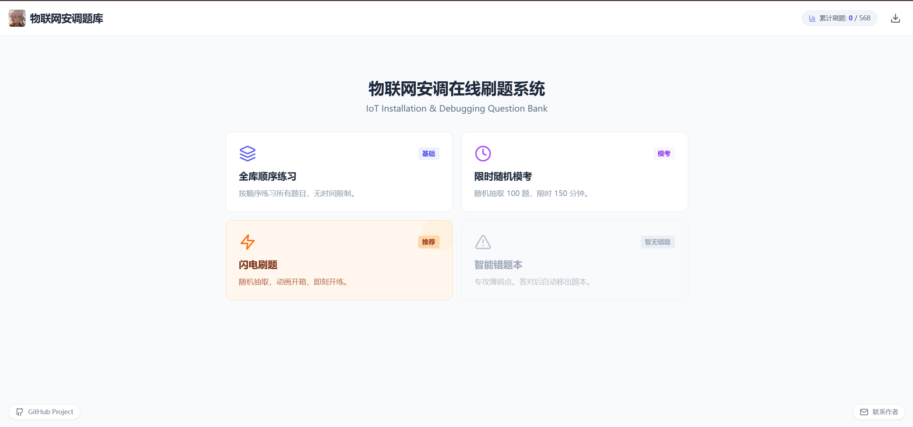
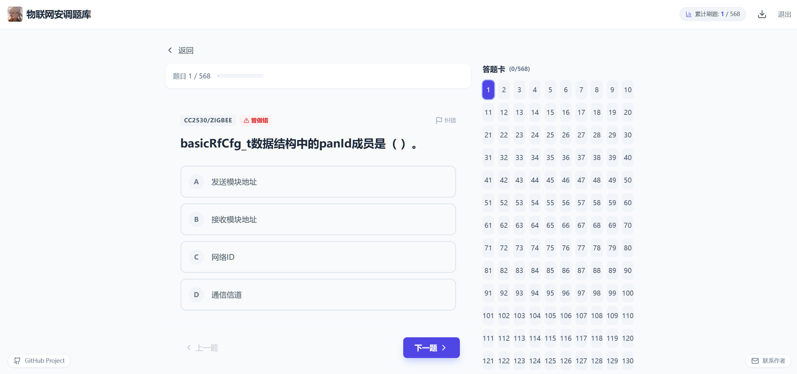
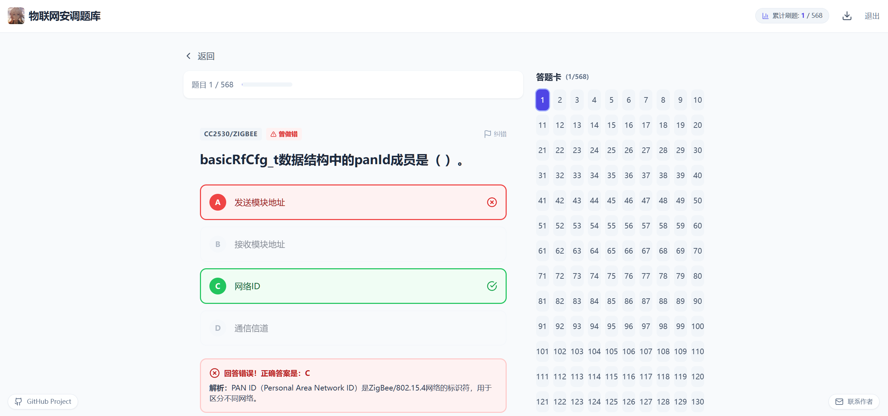
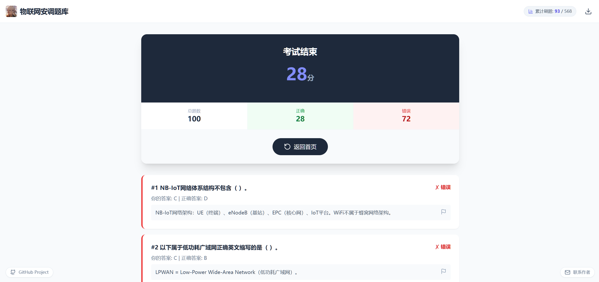
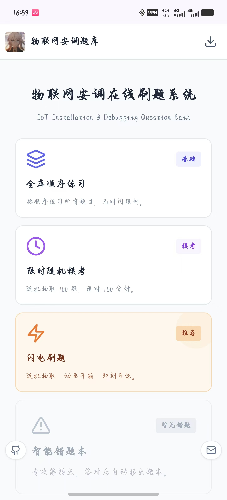

# IOT-Testing - 物联网题库系统


一个专为物联网课程设计的在线题库系统，支持单选题、多选题和判断题，提供实时答题反馈和成绩统计功能。

🌐 **在线访问**: [https://awfp1314.github.io/IOT-Testing/](https://awfp1314.github.io/IOT-Testing/)

## 📖 项目背景

这是一个为学校物联网课程考试准备的题库系统，帮助学生更好地复习和备考。

- **实际用户**: 40+ 名学生使用
- **题目数量**: 涵盖物联网核心知识点
- **使用场景**: 课程复习、考前练习、知识巩固

## ✨ 功能特性

- 📝 **多种题型支持** - 单选题、多选题、判断题
- ✅ **实时答题反馈** - 即时显示答案正确性
- 📊 **成绩统计** - 自动计算得分和正确率
- 🎯 **题目解析** - 详细的答案解析帮助理解
- 💾 **本地存储** - 答题记录保存在浏览器本地
- 📱 **响应式设计** - 支持手机、平板、电脑多端访问
- 🚀 **快速加载** - 基于 Vite 构建，秒开体验

## 📱 界面预览

### 主界面



### 答题界面



### 答案解析



### 成绩统计



### 移动端适配



## 🛠️ 技术栈

- **前端框架**: React 18.2
- **构建工具**: Vite 5.0
- **样式方案**: TailwindCSS 3.4
- **图标库**: Lucide React
- **数据存储**: Supabase (可选)
- **部署平台**: GitHub Pages

## 📦 安装与运行

### 环境要求

- Node.js 16+
- npm 或 yarn

### 本地开发

```bash
# 克隆仓库
git clone https://github.com/Awfp1314/IOT-Testing.git
cd IOT-Testing

# 安装依赖
npm install

# 解析题目数据
npm run parse

# 启动开发服务器
npm run dev
```

访问 `http://localhost:5173` 查看应用。

### 构建部署

```bash
# 构建生产版本
npm run build

# 预览构建结果
npm run preview
```

## 📂 项目结构

```
IOT-Testing/
├── src/                    # 源代码目录
│   ├── components/         # React 组件
│   ├── data/              # 题目数据
│   ├── utils/             # 工具函数
│   └── App.jsx            # 主应用组件
├── public/                # 静态资源
├── scripts/               # 构建脚本
│   └── parseQuestions.js  # 题目解析脚本
├── server/                # 服务端代码（可选）
├── index.html             # HTML 入口
├── vite.config.js         # Vite 配置
└── package.json           # 项目配置
```

## 🎯 使用说明

1. **开始答题**: 打开应用后选择题目类型开始答题
2. **查看解析**: 提交答案后可查看详细解析
3. **统计成绩**: 完成所有题目后查看总体成绩
4. **重新练习**: 可随时重置进度重新开始

## 📊 数据统计

- ✅ 服务学生数量: 40+
- 📝 题目总数: 根据课程内容持续更新
- 🎓 覆盖知识点: 物联网基础、传感器、通信协议、应用开发等

## 🤝 贡献

欢迎提交 Issue 和 Pull Request 来帮助改进项目。

## 📄 许可证

本项目采用 MIT 许可证 - 详见 [LICENSE](LICENSE) 文件

## 👨‍💻 作者

HUTAO

---

**注**: 本项目仅用于学习交流，题目内容来源于课程教材和公开资料。
